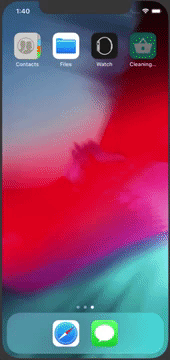

# Ebay API iOS application

Designed an iOS application using eBay API with functionalities like

1 Wish List (using Local Storage) for offline usage.
2 Search for product using product name, category, categories, shipping, zip code
3 Facebook share option
4 Ebay product similar photos using Google API
5 Offline saving Product details

1. A numbered list
    1. A nested numbered list
    2. Which is numbered
2. Which is numbered
